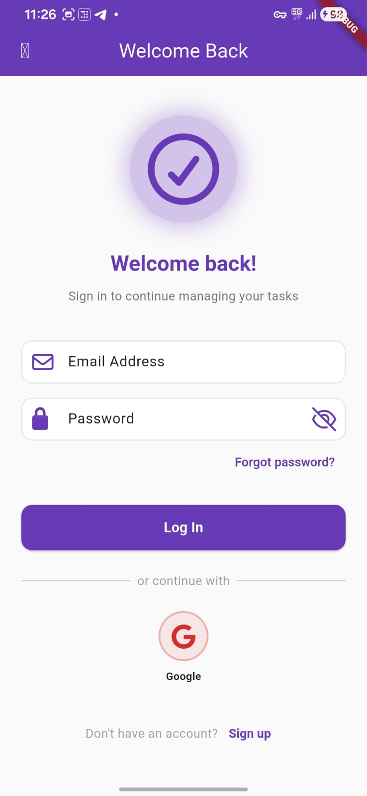
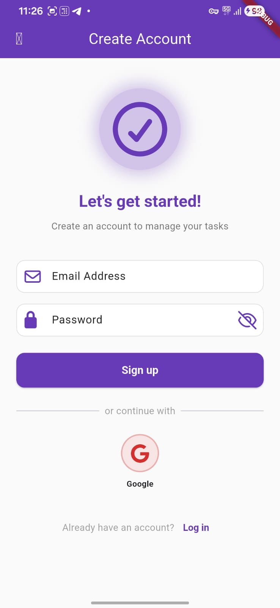
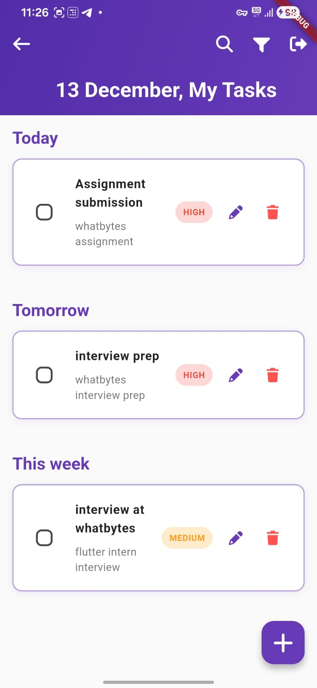
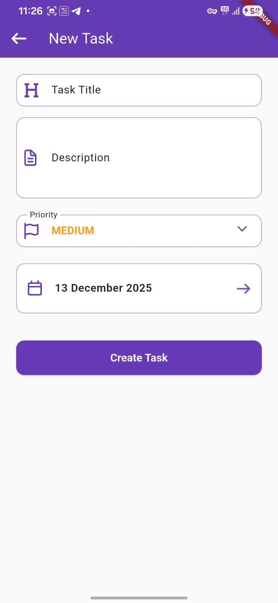
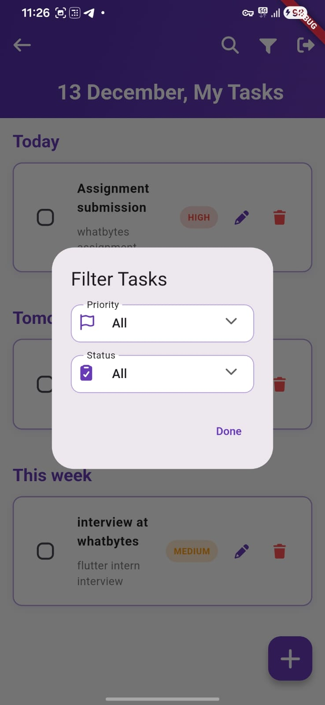

# Task Management App

## 📱 App Overview

A simple task management app for gig workers that allows users to create, update, delete, and view tasks. Built with Flutter and Firebase, this project is designed to be a practical and intuitive tool for managing daily tasks.

## ✨ Features Implemented

- **User Authentication**: Secure sign-up and login with email/password and Google Sign-In via Firebase Authentication.
- **Task Management (CRUD)**: Create, read, update, and delete tasks with ease.
- **Task Properties**: Each task includes a title, description, due date, and priority level (low, medium, high).
- **Task Status**: Mark tasks as complete or incomplete to track your progress.
- **Filtering and Sorting**: Filter tasks by priority and status, with all tasks automatically sorted by their due date.
- **Clean UI**: A responsive and intuitive user interface built with Material Design principles.

## 📸 Screenshots / Screen Recording

<table>
  <tr>
    <td></td>
    <td></td>
    <td></td>
  </tr>
  <tr>
    <td></td>
    <td></td>
    <td></td>
  </tr>
</table>


## 🧱 Architecture

This project follows the principles of **Clean Architecture**, which separates the codebase into three distinct layers to ensure a modular, scalable, and maintainable structure:

- **Data Layer**: This layer is responsible for all data-related operations. It handles data sources, such as Firebase Firestore, and implements the repositories defined in the domain layer.
- **Domain Layer**: This is the core of the application, containing the business logic. It includes entities, use cases, and repository contracts, and is completely independent of the other layers.
- **Presentation Layer**: This layer manages the UI and state. It includes all the screens, widgets, and providers, and it interacts with the domain layer through use cases.

## 🧠 State Management

**Riverpod** is used for state management in this project. It provides a simple and scalable way to manage state, making it easy to access and modify data from anywhere in the app while keeping the UI and business logic separate.

## 🔐 Firebase Setup

This project uses Firebase for authentication and database services.

- **Firebase Authentication**: Handles user sign-up and login for both email/password and Google Sign-In.
- **Cloud Firestore**: A NoSQL database used to store and manage all task-related data.

## 🛠 How to Run the App

1.  **Clone the repository**:
    ```sh
    git clone <repository-url>
    ```
2.  **Set up Firebase**:
    - Create a new Firebase project.
    - Add your Android app to the project and download the `google-services.json` file.
    - Place the `google-services.json` file in the `android/app` directory.
    - In the Firebase console, enable **Email/Password** and **Google** sign-in methods.
    - Generate and add the **SHA-1 fingerprint** for Google Sign-In to work correctly.
3.  **Install dependencies**:
    ```sh
    flutter pub get
    ```
4.  **Run the app**:
    ```sh
    flutter run
    ```

## 🚀 APK Download Link

*(Optional: Add a link to your release APK here)*

